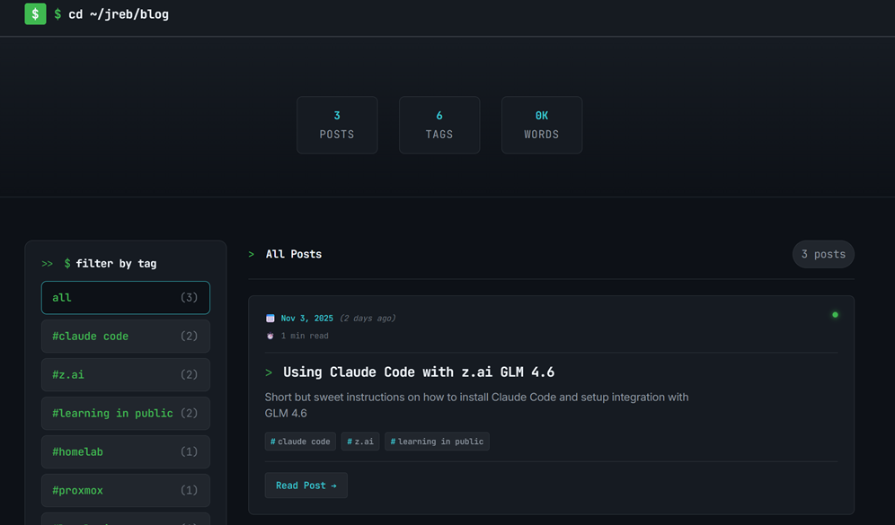

# Terminal Blog 🚀

A stunning, terminal-inspired Astro blog template with a sophisticated CSS architecture and developer-first design system.



[](https://astro.build)
[](https://www.typescriptlang.org/)
[](https://pnpm.io/)
[](LICENSE)
[](https://vercel.com/new/clone?repository-url=https://github.com/yourusername/terminal-blog)

## ✨ Features

### 🖥️ Terminal-Inspired Design
- **GitHub Dark Terminal Theme**: Custom color palette inspired by developer terminals
- **Fluid Typography System**: Modern clamp() based typography with perfect scaling
- **Terminal Loading Screen**: Animated terminal-style loading experience (first load only)
- **Custom Scrollbars**: Styled scrollbars that match the terminal aesthetic
- **Interactive Elements**: Hover states, transitions, and micro-interactions

### 🎨 Sophisticated CSS Architecture
- **Modular CSS System**: Organized by purpose (tokens, reset, base, layout, components, utilities)
- **300+ Design Tokens**: Complete design system with CSS custom properties
- **Performance Optimized**: GPU-accelerated animations and containment
- **Accessibility First**: ARIA labels, focus management, high contrast mode
- **Mobile-First Responsive**: Breakpoint system that works on all devices

### 📝 Advanced Blog Features
- **Interactive Blog Cards**: Metadata, reading time, tags, and hover effects
- **Automatic Table of Contents**: Generated from blog post headings
- **Reading Progress**: Visual progress indicator for long articles
- **Social Sharing**: Built-in sharing functionality for major platforms
- **Related Posts**: Smart recommendations based on tag similarity
- **Syntax Highlighting**: Beautiful code blocks with terminal styling

### ⚡ Developer Experience
- **TypeScript Support**: Full type safety and IntelliSense
- **Component-Based**: Reusable Astro components with clean architecture
- **Static Generation**: Blazing-fast static site generation
- **SEO Optimized**: Meta tags, structured data, and performance best practices
- **Print Styles**: Optimized styles for printing blog content

## 🚀 Quick Start

### Prerequisites
- **Node.js** 18.0 or higher
- **pnpm** 9.0 or higher (recommended)

### Installation

1. **Clone the repository**
   ```bash
   git clone https://github.com/yourusername/terminal-blog.git
   cd terminal-blog
   ```

2. **Install dependencies**
   ```bash
   pnpm install
   ```

3. **Start development server**
   ```bash
   pnpm dev
   ```

4. **Open your browser**
   Navigate to `http://localhost:4321`

### Build & Deploy

```bash
# Build for production
pnpm build

# Preview production build
pnpm preview
```

## 📁 Project Structure

```
terminal-blog/
├── public/
│   ├── styles/                 # Modular CSS architecture
│   │   ├── tokens.css         # Design tokens (colors, spacing, typography)
│   │   ├── reset.css          # CSS reset
│   │   ├── base.css           # Base element styles
│   │   ├── layout.css         # Grid system and containers
│   │   ├── components.css     # Reusable component styles
│   │   ├── utilities.css      # Single-purpose utility classes
│   │   ├── animations.css     # Animations and transitions
│   │   ├── scrollbars.css     # Custom scrollbar styling
│   │   ├── global.css         # Global styles and variables
│   │   └── main.css           # Main entry point
│   └── favicon.ico
├── src/
│   ├── components/             # Reusable Astro components
│   │   ├── BlogCard.astro     # Blog post preview cards
│   │   ├── EnhancedCodeBlock.astro  # Styled code blocks
│   │   ├── LoadingScreen.astro      # Terminal loading animation
│   │   ├── Metadata.astro     # Post metadata display
│   │   ├── Navigation.astro   # Terminal-style navigation
│   │   └── Typography.astro   # Typography utilities
│   ├── layouts/               # Layout components
│   │   ├── Layout.astro       # Main layout with SEO
│   │   └── MarkdownPostLayout.astro  # Blog post layout
│   └── pages/                 # Pages and blog posts
│       ├── index.astro        # Homepage with blog listings
│       └── posts/             # Blog posts (Markdown files)
├── package.json
├── tsconfig.json
└── CLAUDE.md                  # Project documentation
```

## 🎨 Customization

### Theme Customization

The terminal theme is controlled by design tokens in `public/styles/tokens.css`. You can easily customize:

```css
/* Terminal color palette */
:root {
  --color-primary: #58a6ff;
  --color-background: #0d1117;
  --color-surface: #161b22;
  --color-text: #c9d1d9;
  --color-accent: #f85149;
}

/* Typography scale */
:root {
  --font-size-base: clamp(1rem, 2vw, 1.125rem);
  --line-height-base: 1.7;
}
```

### Adding Blog Posts

1. Create a new Markdown file in `src/pages/posts/`
2. Add frontmatter with metadata:

```yaml
---
title: "Your Blog Post Title"
pubDate: 2025-11-05
description: "A brief description of your post"
author: "Your Name"
tags: ["tag1", "tag2", "tag3"]
image: "./path/to/featured-image.jpg"
draft: false  # Set to true to hide from production
---
```

### Component Customization

All components are designed to be easily customizable:

- **BlogCard.astro**: Modify post preview styling
- **Navigation.astro**: Customize navigation and keyboard shortcuts
- **Metadata.astro**: Change how post metadata is displayed
- **LoadingScreen.astro**: Adjust the terminal loading animation

## 🛠 Development Workflow

### Available Scripts

```bash
# Development
pnpm dev              # Start dev server with hot reload

# Building
pnpm build            # Build for production
pnpm preview          # Preview production build locally

# Astro CLI
pnpm astro add <package>    # Add Astro integrations
pnpm astro check            # Type check the project
pnpm astro -- --help        # Get help with Astro CLI
```

### Development Best Practices

1. **Component Development**: Build reusable components in `src/components/`
2. **CSS Architecture**: Follow the modular CSS pattern in `public/styles/`
3. **Content Management**: Use Markdown with frontmatter for blog posts
4. **Type Safety**: Leverage TypeScript for better development experience
5. **Performance**: Keep an eye on bundle size and Core Web Vitals

## 🎯 CSS Architecture Deep Dive

This template showcases a sophisticated CSS architecture that serves as both a functional design system and an educational resource:

### **tokens.css** - Design System Foundation
- **300+ CSS Custom Properties** for complete design control
- **Color System**: Terminal-inspired palette with semantic naming
- **Typography Scale**: Fluid typography using clamp() for perfect responsiveness
- **Spacing System**: Consistent spacing scale based on mathematical ratios
- **Animation Variables**: Centralized animation timing and easing functions

### **Modular Organization**
```
tokens.css     → Design tokens (single source of truth)
reset.css      → CSS reset for cross-browser consistency
base.css       → HTML element styles with semantic classes
layout.css     → Grid system, containers, responsive utilities
components.css → Reusable component patterns
utilities.css  → Single-purpose utility classes
animations.css → Animations and transitions
```

### **Performance Features**
- **CSS Containment**: Optimized rendering with `contain` property
- **GPU Acceleration**: Hardware-accelerated animations with `transform3d`
- **Critical CSS**: Optimized loading with inlined critical styles
- **Efficient Selectors**: BEM-style naming for maintainable CSS

### **Accessibility Features**
- **Focus Management**: Visible focus indicators for keyboard navigation
- **ARIA Labels**: Proper semantic markup for screen readers
- **High Contrast Mode**: Optimized for Windows High Contrast
- **Reduced Motion**: Respects user's motion preferences

## 🌐 Deployment

### Static Hosting Options

This template works perfectly with any static hosting service:

#### Vercel (Recommended)
```bash
# Connect to Vercel
vercel

# Or use the Git integration
git push origin main  # Auto-deploys on Vercel
```

#### Netlify
```bash
# Build command
pnpm build

# Publish directory
dist
```

#### GitHub Pages
```yaml
# .github/workflows/deploy.yml
name: Deploy to GitHub Pages
on:
  push:
    branches: [ main ]
jobs:
  deploy:
    runs-on: ubuntu-latest
    steps:
      - uses: actions/checkout@v4
      - uses: withastro/action@v2
        with:
          path: ./dist
```

### Environment Variables

Create `.env` for local development:
```env
# Site configuration
SITE_URL=http://localhost:4321
SITE_NAME="Terminal Blog"
SITE_DESCRIPTION="A terminal-inspired blog template"
```

## 🤝 Contributing

We welcome contributions! Here's how you can help:

### Reporting Bugs

1. Check existing issues first
2. Create a new issue with:
   - Clear title and description
   - Steps to reproduce
   - Expected vs actual behavior
   - Environment details

### Suggesting Features

1. Open an issue with "Feature Request" label
2. Describe the feature and use case
3. Explain why it would be valuable

### Code Style Guidelines

- **TypeScript**: Use TypeScript for all new code
- **CSS**: Follow the existing modular CSS architecture
- **Components**: Keep components focused and reusable
- **Documentation**: Update documentation for new features
- **Testing**: Ensure all changes work as expected

### Development Setup

```bash
# Clone your fork
git clone https://github.com/yourusername/terminal-blog.git
cd terminal-blog

# Install dependencies
pnpm install

# Start development
pnpm dev

# Make your changes
# ...

# Run type checking
pnpm astro check

# Build to verify
pnpm build
```

## 🙏 Credits & Acknowledgments

### Built With
- **[Astro](https://astro.build)** - Modern static site generator
- **[TypeScript](https://www.typescriptlang.org/)** - Type-safe JavaScript
- **[pnpm](https://pnpm.io/)** - Fast, disk space efficient package manager

### Inspiration & References
- **GitHub Design System** - Terminal color palette inspiration
- **CSS-Tricks** - Modular CSS architecture patterns
- **MDN Web Docs** - CSS best practices and reference
- **Every Layout** - Grid and layout system inspiration

### Community
- Thanks to the **Astro community** for building such an amazing framework
- Inspired by **terminal-based tools** and the developer aesthetic
- Built with ❤️ for the web development community

---

**⭐ Star this repository if it helped you!**

Made with [Astro](https://astro.build) · [MIT License](LICENSE)

[](https://github.com/yourusername/terminal-blog)
[](https://github.com/yourusername/terminal-blog)

</div>